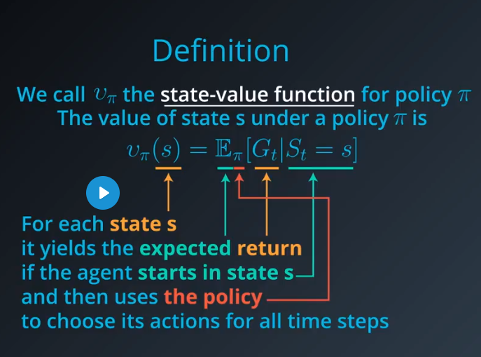
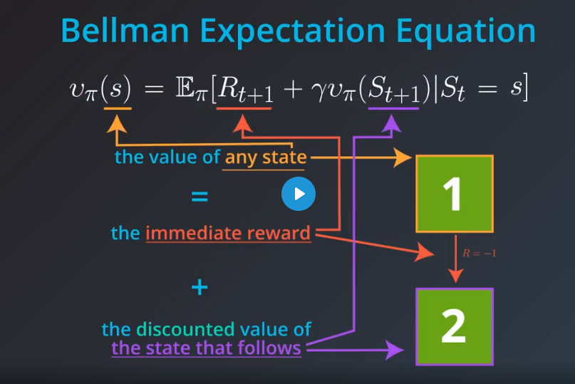
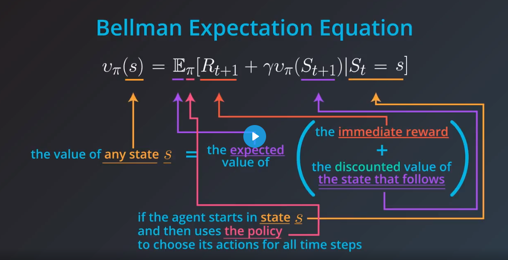

# Introduction

Deep Reinforcement Learning for Robotics is a paradigm shift. 
The basic idea is to start with raw sensor input, define a goal for the robot, and let it figure out, through trial and error, the best way to achieve the goal.
In this paradigm, perception, internal state, planning, control, and even sensor and measurement uncertainty, are not explicitly defined. 
All of those traditional steps between observations (the sensory input) and actionable output are learned by a neural network.

## The Setting

The reinforcement learning (RL) framework is characterized by an agent learning to interact with its environment.

At each time step, the agent receives the environment's state (the environment presents a situation to the agent), and the agent must choose an appropriate action in response. One time step later, the agent receives a reward (the environment indicates whether the agent has responded appropriately to the state) and a new state.

All agents have the goal to maximize expected cumulative reward, or the expected sum of rewards attained over all time steps.

# Sparse Rewards in Reinforcement Learning
Say you are an agent, and your goal is to play chess. At every time step, you choose any action from the set of possible moves in the game. Your opponent is part of the environment; she responds with her own move, and the state you receive at the next time step is the configuration of the board, when it’s your turn to choose a move again. The reward is only delivered at the end of the game, and, let’s say, is +1 if you win, and -1 if you lose.

This is an episodic task, where an episode finishes when the game ends. The idea is that by playing the game many times, or by interacting with the environment in many episodes, you can learn to play chess better and better.

It's important to note that this problem is exceptionally difficult, because the feedback is only delivered at the very end of the game. So, if you lose a game (and get a reward of -1 at the end of the episode), it’s unclear when exactly you went wrong: maybe you were so bad at playing that every move was horrible, or maybe instead … you played beautifully for the majority of the game, and then made only a small mistake at the end.

When the reward signal is largely uninformative in this way, we say that the task suffers the problem of sparse rewards. 

- A task is an instance of the reinforcement learning (RL) problem.
- Continuing tasks are tasks that continue forever, without end.
- Episodic tasks are tasks with a well-defined starting and ending point.
  - In this case, we refer to a complete sequence of interaction, from start to finish, as an episode.
  - Episodic tasks come to an end whenever the agent reaches a terminal state.

- Reward hypothesis: All goals can be framed as the maximization of (expected) cumulative reward.

- Discounted Return
For an arbitrary time step 𝑡, both refer to:

𝐺𝑡 ≐ 𝑅ₜ₊₁ + γ𝑅ₜ₊₂ + γ²𝑅ₜ₊₃ + …

$$
\sum_{k=0}^{\infty} \gamma^k R_{t+k+1}, \text{ where } \gamma \in [0,1]
$$

In particular, when we refer to "return," it is not necessarily the case that 𝛾 = 1; and when we refer to "discounted return," it is not necessarily true that 𝛾 < 1.

- The discount rate 𝛾 is something that you set to refine the goal that you have for the agent.
- It must satisfy 0 ≤ 𝛾 ≤ 1.
- If 𝛾 = 0, the agent only cares about the most immediate reward.
- If 𝛾 = 1, the return is not discounted.
- For larger values of 𝛾, the agent cares more about the distant future.
- Smaller values of 𝛾 result in more extreme discounting, where - in the most extreme case - the agent only cares about the most immediate reward.

# Markov Decision Process (MDP).

In general, the state space S is the set of all nonterminal states.

In continuing tasks, this is equivalent to the set of all states.

In episodic tasks, we use S⁺ to refer to the set of all states, including terminal states.

The action space A is the set of possible actions available to the agent.

In the event that there are some states where only a subset of the actions are available, we can also use A(s) to refer to the set of actions available in state s ∈ S.

At an arbitrary time step 𝑡, the agent-environment interaction has evolved as a sequence of states, actions, and rewards:

(S₀, A₀, R₁, S₁, A₁, …, Rₜ₋₁, Sₜ₋₁, Aₜ₋₁, Rₜ, Sₜ, Aₜ)

When the environment responds to the agent at time step t+1, it considers only the state and action at the previous time step (Sₜ, Aₜ).

In particular, it does not care what state was presented to the agent more than one step prior. (In other words, the environment does not consider any of S₀, …, Sₜ₋₁.)

And, it does not look at the actions that the agent took prior to the last one. (In other words, the environment does not consider any of A₀, …, Aₜ₋₁.)

Furthermore, how well the agent is doing or how much reward it is collecting has no effect on how the environment chooses to respond to the agent. (In other words, the environment does not consider any of R₀, …, Rₜ.)

Because of this, we can completely define how the environment decides the state and reward by specifying

𝑝(s′, r∣s, a) ≐ 𝑃(Sₜ₊₁ = s′, Rₜ₊₁ = r∣Sₜ = s, Aₜ = a)

for each possible s′, r, s, and a. These conditional probabilities are said to specify the one-step dynamics of the environment.

A Markov decision Process is defined by:
- a (finite) set of states S
- a (finite) set of actions A
- a (finite) set of rewards R
- the one step dynamics of the environment 
    𝑝(s′, r∣s, a) ≐ 𝑃(Sₜ₊₁ = s′, Rₜ₊₁ = r∣Sₜ = s, Aₜ = a) for each possible s′, r, s, and a.
- a discount rate  $$\gamma \in [0,1]$$

# Policy

A policy determines how an agent chooses an action in response to the current state. In other words, it specifies how the agent responds to situations that the environment has presented.
## Deterministic Policy: 

An example deterministic policy π
: 𝑆 → 𝐴 can be specified as:

- π (low) = recharge
- π (high) = search

In this case:

- If the battery level is low, the agent chooses to recharge the battery.
- If the battery level is high, the agent chooses to search for cans.

## Stochastic Policy:

An example stochastic policy π: 𝑆×𝐴 → [0,1] can be specified as:

- π(recharge∣low) = 0.5
- π(wait∣low) = 0.4
- π(search∣low) = 0.1
- π(search∣high) = 0.9
- π(wait∣high) = 0.1

In this case:

- If the battery level is low, the agent recharges the battery with a 50% probability, waits for cans with a 40% probability, and searches for cans with a 10% probability.
- If the battery level is high, the agent searches for cans with a 90% probability and waits for cans with a 10% probability.

## State Value Function

## Bellman's Equations

In this gridworld example:

- Once the agent selects an action, it always moves in the chosen direction (contrasting general MDPs where the agent doesn't always have complete control over what the next state will be).
- The reward can be predicted with complete certainty (contrasting general MDPs where the reward is a random draw from a probability distribution).

The value of any state can be calculated as the sum of the immediate reward and the (discounted) value of the next state.

For a general MDP, we have to work in terms of an expectation since it's not often the case that the immediate reward and the next state can be predicted with certainty. Indeed, the reward and next state are chosen according to the one-step dynamics of the MDP. In this case, where the reward 𝑟 and the next state 𝑠′ are drawn from a (conditional) probability distribution 𝑝(𝑠′,𝑟∣𝑠,𝑎), the Bellman Expectation Equation (for vπ) expresses the value of any state s in terms of the expected immediate reward and the expected value of the next state:

$$
v_\pi(s) = E_\pi[R_{t+1} + \gamma v_\pi(S_{t+1}) | S_t = s]
$$

## Calculating the Expectation

In the event that the agent's policy π is deterministic, the agent selects action π(s) when in state s, and the Bellman Expectation Equation can be rewritten as the sum over two variables (s' and r):

$$
v_\pi(s) = \sum_{s' \in S^+, r \in R} p(s', r | s, \pi(s)) \left(r + \gamma v_\pi(s')\right)
$$

In this case, we multiply the sum of the reward and discounted value of the next state (r + γv_\pi(s')) by its corresponding probability p(s', r |s, π(s)) and sum over all possibilities to yield the expected value.

If the agent's policy π is stochastic, the agent selects action a with probability π(a|s) when in state s, and the Bellman Expectation Equation can be rewritten as the sum over three variables (s′,r, and a):

$$
v_\pi(s) = \sum_{s' \in S^+, r \in R, a \in A(s)} \pi(a | s) p(s', r | s, a) \left(r + \gamma v_\pi(s')\right)
$$

In this case, we multiply the sum of the reward and discounted value of the next state (r + γv_\pi(s')) by its corresponding probability π(a|s) p(s',r|s, a) and sum over all possibilities to yield the expected value.